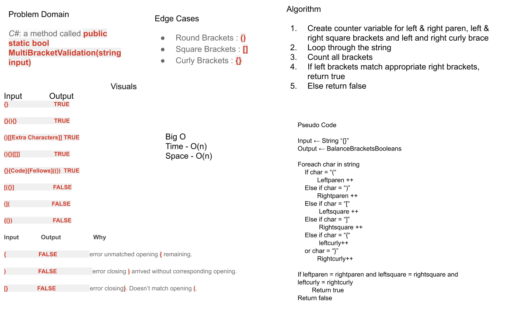

- [*] Top-level README “Table of Contents” is updated
- [*] Feature tasks for this challenge are completed
- [*] README for this challenge is complete
- [*] Summary, Description, Approach & Efficiency, Solution
- [*] Link to code -https://github.com/Omac092627/data-structures-and-algorithms/tree/master/Code%20Challenges/401%20Code%20Challenges/MultiValid

# Multi-Bracket-Validation
<!-- Short summary or background information -->
C#: a method called public static bool MultiBracketValidation(string input)
Your function should take a string as its only argument, and should return a boolean representing whether or not the brackets in the string are balanced. 
There are 3 types of brackets:
Round Brackets : ()
Square Brackets : []
Curly Brackets : {}

## Challenge
<!-- Description of the challenge -->

Return true or false on whther the brackets are balanced are not. 

Take into account different types of brackets:
Input	Output
{}	TRUE
{}(){}	TRUE
()[[Extra Characters]]	TRUE
(){}[[]]	TRUE
{}{Code}[Fellows](())	TRUE
[({}]	FALSE
(](	FALSE
{(})	FALSE

## Approach & Efficiency
<!-- What approach did you take? Why? What is the Big O space/time for this approach? -->
I worked to build out the method first. Scaffold the inside of the method with if/else statements of comparison.

## Whiteboard

