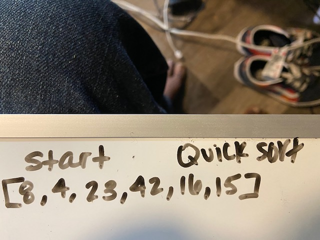

# Insertion Sort

## Overview
-  Quick sort is a comparison sort, meaning that it can sort items of any type for which a "less-than" relation (formally, a total order) is defined.
- O(n log n)

## How it works
1.Begin with method.
2.Position Defined.
3.Sort Left.
4.Sort Right.
5.Pivot.
6.Set Pivot Value.
7.Variable to track.
8.Define largest index.
9.Define lowest.
10.Swap.
11.Pivot set to middle. 
12.All members on right largest.
13.Return low which is midpoint.

## PseudoCode

[8,4,23,42,16,15]
ALGORITHM QuickSort(arr, left, right)
    if left < right
        // Partition the array by setting the position of the pivot value 
        DEFINE position <-- Partition(arr, left, right)
        // Sort the left
        QuickSort(arr, left, position - 1)
        // Sort the right
        QuickSort(arr, position + 1, right)

ALGORITHM Partition(arr, left, right)
    // set a pivot value as a point of reference
    DEFINE pivot <-- arr[right]
    // create a variable to track the largest index of numbers lower than the defined pivot
    DEFINE low <-- left - 1
    for i <- left to right do
        if arr[i] <= pivot
            low++
            Swap(arr, i, low)

     // place the value of the pivot location in the middle.
     // all numbers smaller than the pivot are on the left, larger on the right. 
     Swap(arr, right, low + 1)
    // return the pivot index point
     return low + 1

ALGORITHM Swap(arr, i, low)
    DEFINE temp;
    temp <-- arr[i]
    arr[i] <-- arr[low]
    arr[low] <-- temp

