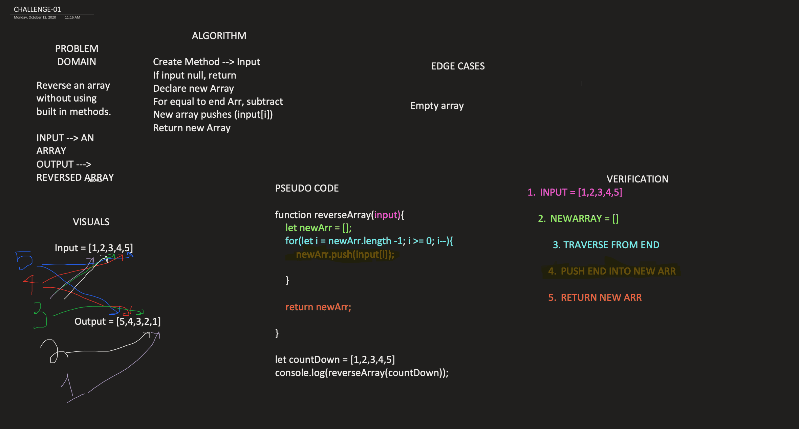

# Reverse an Array

## Author: Lami Beach

401 Code Challenges Day 2 - Reverse an Array
- [*] Top-level README �Table of Contents� is updated
- [*] Feature tasks for this challenge are completed
- [*] README for this challenge is complete
- [*] Summary, Description, Approach & Efficiency, Solution
- [*] Link to code - 
- [*] Picture of whiteboard

## Challenge details
Write a function that reverses an Array without utilizing the built-in methods.

## Solution image - Whiteboard
